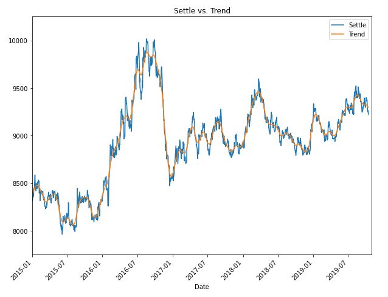
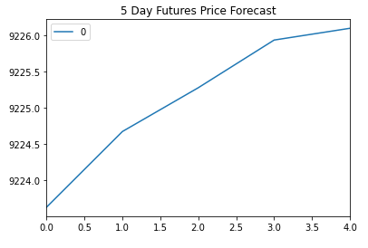
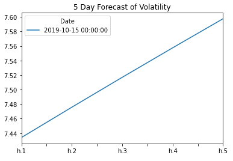
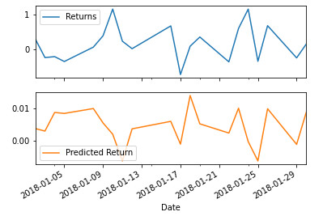

# Currency Predictions
The notebooks in this repository predict future prices, returns, and volatility (i.e., risk) for the Japanese yen to USD exchange rates. The first notebook uses time series forecasting and the second uses linear regression forecasting.

---

## Time Series Forecasting

Based on the forecasting, conclusions were drawn to answer the following questions:

### 1. Based on your time series analysis, would you buy the yen now?

Based on the data from 2017-2019 shown in the plot below, the price of the yen is increasing and it is still well below its all time high in 2012, both of which are good signs. Although the trend (shown) in organge bounces up and down, it generally is trending upward during those years.  

The results of the ARMA and ARIMA models (although they don't appear accurate - see conclusion in Question 3 below) show the price will continue to increase in the next five days, although it may start to plateau around day 5. This potential plateau is evident by the flattening of the curve in the price plot and the drop in the curve on the returns plot. Given all this data (i.e., rising trend and expected short term gains), AND the assumption that the models are correct, I would buy the yen now.

As a side note, ARMA has been deprecated and removed from my Python, so ARIMA with a middle input of "0" was used to mimic an ARMA model.

### 2. Is the risk of the yen expected to increase or decrease?

From the GARCH model forecast, the volatilty (and thus the risk) is expected to increase in the near future.

### 3. Based on the model evaluation, would you feel confident in using these models for trading?
I would not feel comfortable using the ARMA or ARIMA models for trading without first performing further analysis and tweaking of the AR and MA values. In the model summary, the p-values for each model are well above 0.05, the AIC and BIC values are high (they should be low), and the Log Likelihood is low (it should be high). For the GARCH model, all but one of the p-values are less than 0.05 which is good, but again there are high AIC/BIC values and low Log Likelihood values which are not indicative of an accurate model. All of these points do not give me much confidence that the models are accurate as-is.

---

## Linear Regression Forecasting

Based on the forecasting, conclusions were drawn to answer the following question:

### 1. Does this model perform better or worse on out-of-sample data compared to in-sample data?

The relatively simlar and small RMSE values of 0.706 for the training (in-sample) and 0.414 for the testing (out-of-sample) data shows the the model is accurate. Since the testing RMSE is lower than that for training, it can be concluded that the model is not overfit. The plot below shows the comparison of the model outputs (testing data) to the actual data.

